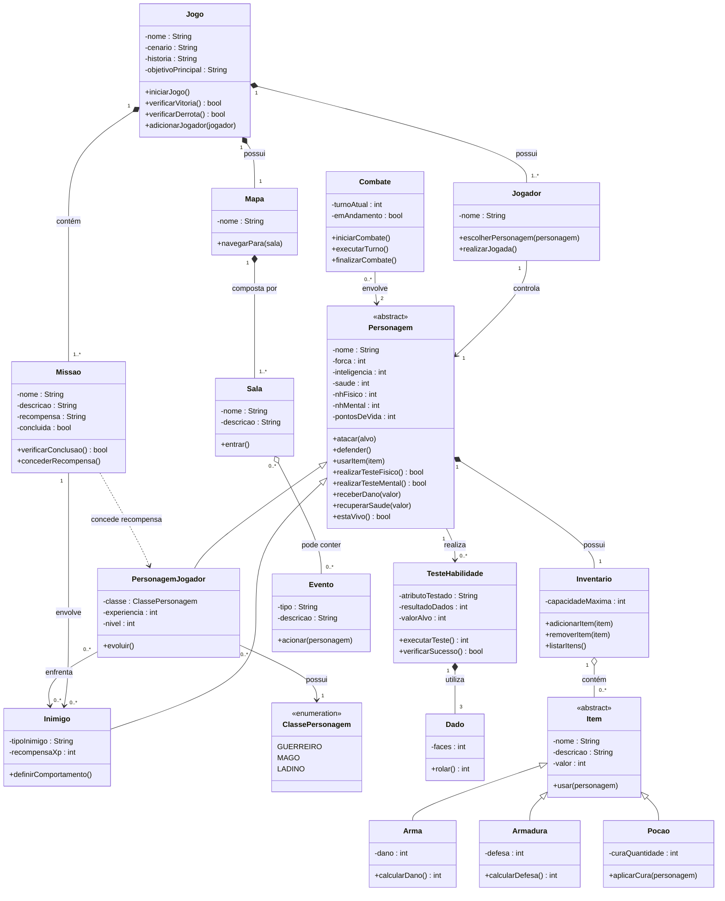

# Crônicas de Aetherion — Projeto RPG (Nível 1)

## 1. Descrição textual do jogo

**Nome do jogo:** Crônicas de Aetherion

**Cenário:** O reino medieval de Aetherion, dividido em vilarejos, florestas, masmorras e ruínas antigas, ameaçado pelo retorno de um feiticeiro caído em desgraça há séculos.

**História:** Após anos de paz, sinais de corrupção mágica voltam a surgir nas terras de Aetherion: criaturas hostis se multiplicam, vilarejos são atacados e rumores apontam para o despertar do Feiticeiro Sombrio, Malachar, aprisionado havia gerações sob a Torre Esquecida. Um grupo de aventureiros é convocado pelo Conselho do Reino para investigar e impedir seu retorno completo.

**Objetivo principal:** Reunir os três Fragmentos do Selo (itens de missão), atravessar a Torre Esquecida e derrotar Malachar antes que ele recupere todo o seu poder.

**Personagens (classes jogáveis):** Guerreiro (força elevada), Mago (inteligência elevada), Ladino (equilíbrio entre atributos, bônus em testes físicos de furtividade).

**Inimigos:** Goblins (fracos, em grupo), Bandidos (médios), Guardiões de Pedra (fortes, resistentes a dano físico), Malachar (chefe final).

**Regras básicas:**
- Cada personagem possui Força, Inteligência e Saúde (3 a 18) e Níveis de Habilidade Físico (NH Físico) e Mental (NH Mental).
- Toda ação de sorte/habilidade é resolvida com **3 dados de 6 faces**: se a soma for **menor** que o NH correspondente, a ação é bem-sucedida; se for **maior ou igual**, é fracasso.
- Combate é resolvido por rodadas de `TesteHabilidade` (ataque) entre personagem e inimigo; quem falha recebe dano proporcional à diferença do teste.
- Pontos de Vida chegam a 0 → personagem é derrotado (`estaVivo()` retorna falso).
- Itens (armas, armaduras, poções) podem ser usados a qualquer momento fora de combate ativo e modificam dano, defesa ou saúde.

**Regras complementares (exemplos):**
- **Combate:** turnos alternados; iniciativa definida por teste de Inteligência.
- **Dano:** dano da arma reduzido pela defesa da armadura equipada.
- **Cura:** poções restauram saúde até o máximo do personagem.
- **Evolução:** ao concluir uma missão, o personagem ganha experiência; ao acumular XP suficiente, sobe de nível e pode aumentar um atributo.
- **Morte/Derrota:** se todos os personagens do grupo forem derrotados, o jogo termina em derrota.
- **Vitória:** o jogo termina em vitória quando Malachar é derrotado.
- **Eventos aleatórios:** ao entrar em certas salas do mapa, um dado é lançado para determinar se um evento (armadilha, tesouro, emboscada) ocorre.

---

## 2. Diagrama de Classes (UML)

### Legenda de relacionamentos usados
- `*--` Composição (ex.: Jogo possui Missões — sem o jogo, as missões não existem)
- `o--` Agregação (ex.: Sala pode conter Eventos, mas eventos podem existir fora dela)
- `-->` Associação (ex.: Jogador controla Personagem)
- `<|--` Herança (ex.: PersonagemJogador e Inimigo herdam de Personagem)
- `..>` Dependência (ex.: Missao usa PersonagemJogador apenas como parâmetro passageiro em concederRecompensa(), sem guardar referência permanente)

---

## 3. Observações sobre a modelagem

- `Personagem` é uma classe abstrata que concentra os atributos e métodos comuns exigidos (Força, Inteligência, Saúde, NH Físico, NH Mental, Pontos de Vida, ataque, defesa, testes, dano/cura, `estaVivo()`).
- `PersonagemJogador` e `Inimigo` herdam de `Personagem`, evitando duplicação e permitindo que ambos participem de `Combate` e `TesteHabilidade` da mesma forma.
- `TesteHabilidade` centraliza a regra dos 3 dados de 6 faces, reutilizável tanto para testes físicos quanto mentais.
- `Item` é abstrato e especializado em `Arma`, `Armadura` e `Pocao`, permitindo `usarItem()` genérico em `Personagem`.
- Multiplicidades deixam explícito: um `TesteHabilidade` sempre usa exatamente 3 `Dado` (composição "1" *-- "3"); um `Combate` sempre envolve 2 `Personagem` (atacante e defensor).

Nível de implementação: **não requerido nesta etapa**, conforme especificação — este documento cobre apenas a análise e projeto orientado a objetos (Nível I).
